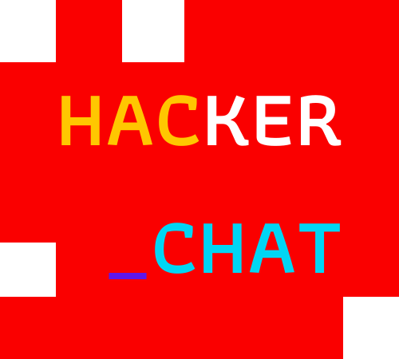

<h1
  align="center"
>
  
</h1>

<h3
  align="capitalize"
>
  Hacker _Chat is a chat application that runs directly on the computer terminal, the application was created in the <a src="https://javascriptexpert.com.br/lc_jse_mar21_inscricao">JavaScript Expert Week</a> by the instructor and JavaScript specialist <a src="https://github.com/erickwendel">Erick Wendel</a>.
</h3>
